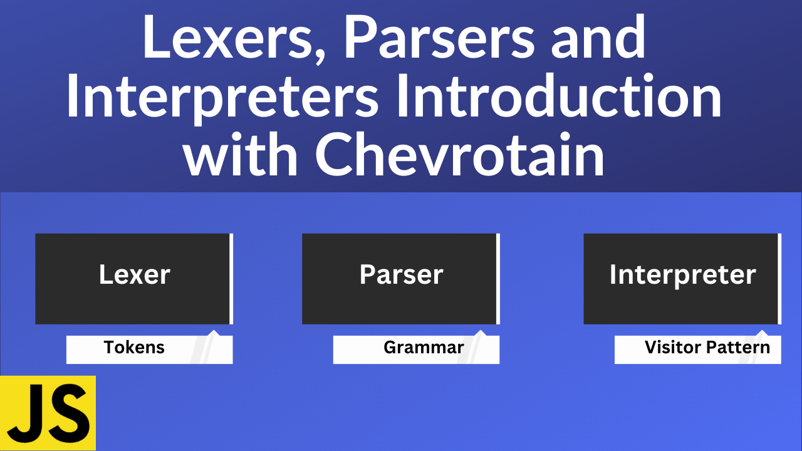

# Introduction to Lexers, Parsers and Interpreters with Chevrotain

### YouTube Tutorial: https://youtu.be/l-jMsoAY64k

## Description

In this exciting tutorial we are going to learn how to use a library called Chevrotain. It can be used to build parser/compilers/interpreters for various use cases ranging from simple config files to full fledged programming languages. If you ever wondered how programming languages are built this video is a great introduction. We will start with an intro to lexers(tokenization), parsers, grammars and much more. Then build a simple calculator that uses all these concepts.

Other than building a simple calculator using chevrotain the concepts that we will learn here are those that are used to build programming languages like javascript, .net, SQL and much more. Perhaps one day you will make your own language There is a lot to understand and this tutorial will give you an idea of further areas to explore.

[]

There are 3 primary concepts in the diagram above.

1. The lexer which takes input as a string and converts the input into a set of tokens.

2. The Parser which takes the tokens from the lexer and returns a syntax tree based on a grammar. The grammar is often expressed in a meta language such as Backus-Naur Form (BNF). The grammar is the language of languages and provides the rules and syntax.

3. The interpreter which takes in the syntax tree and evaluates the result. In this case we return the result of calculator input.

### Chevrotain

https://chevrotain.io/
